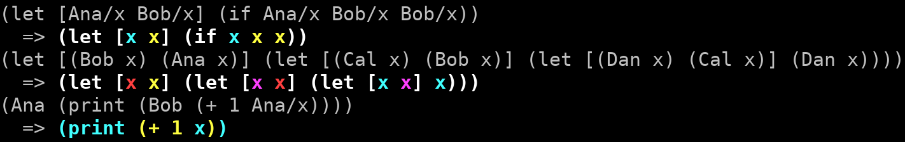

# Klor: Choreographies in Clojure

## Setup

You should have Clojure and Leiningen installed.

Clone the Git repository and use:

- `lein test` to run the test suite,
- `lein run` to run a small role visualization demo.

## Documentation

- [Introduction](./doc/01-intro.md)
- [Syntax](./doc/02-syntax.md)

## Funding

This project is funded through the [NGI Assure Fund](https://nlnet.nl/assure), a fund established by [NLnet](https://nlnet.nl) with financial support from the European Commission's [Next Generation Internet](https://ngi.eu) program. Learn more at the [NLnet project page](https://nlnet.nl/project/ChoreographicProgramming).

&nbsp;&nbsp;&nbsp;&nbsp;

