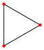
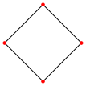
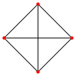
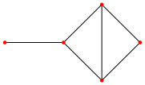
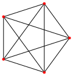
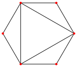
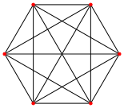
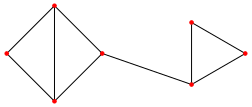
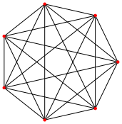

# Evaluation

## Methodology

We implemented a [benchmark](../src/klor/benchmark.clj) to carry out a performance evaluation of Klor based on the [implemented](../src/klor/fokkink.clj) [distributed algorithms](distributed-algorithms.md).
We evaluated the compile-time and the run-time performance using the following selection of algorithms: Chang--Roberts, Itai--Rodeh, Tarry's algorithm, Depth-first search, Echo algorithm, and Echo algorithm with extinction.

In particular, we performed a series of measurements for each combination of algorithm, number of roles (from 3 to 7) and network layout.
The first two algorithms, Chang--Roberts and Itai--Rodeh, specifically work only on ring networks.
The other algorithms work on arbitrary undirected networks, so we tested each one with both a manually chosen layout and a fully connected layout.
The following table shows the layouts we used:

| n | Manually chosen layout                         | Fully connected layout                           |
|--:|:----------------------------------------------:|:------------------------------------------------:|
| 3 |  |  |
| 4 |  |  |
| 5 |  |  |
| 6 |  |  |
| 7 |  |  |

To make measurements consistent and statistically meaningful, we made use of the [Criterium](https://github.com/hugoduncan/criterium) library to aggregate the data from a series of executions and account for the peculiarities of the JVM's just-in-time compiler and garbage collector.
All of the measurements were made on a Linux x86-64 system with an Intel i5-6500 3.20 GHz CPU and 40 GiB of RAM.

## Compile-time Performance

The compile-time phase of Klor consists of parsing the Klor code into an AST, analyzing the AST (type checking, etc.) and compiling (projecting) it to separate pieces of Clojure code for each role.
Evaluating the performance of this phase gives us an idea of how fast Klor is at processing code, which indirectly affects the compilation of any Clojure project using Klor and the experience of developers using Klor interactively at a Clojure REPL.

We measured the compile-time performance by timing the expansion of Klor's `defchor` macro, which implements all of the above.
The tables below report the means and the standard deviations of the measurements for the manually chosen and the fully connected layouts, respectively:

| Algorithm          |       n = 3 |        n = 4 |       n = 5 |        n = 6 |        n = 7 |
|--------------------|------------:|-------------:|------------:|-------------:|-------------:|
| Chang--Roberts     | (44 ± 1) ms |  (58 ± 3) ms | (72 ± 2) ms |  (91 ± 6) ms | (101 ± 3) ms |
| Itai--Rodeh        | (50 ± 2) ms | (76 ± 18) ms | (78 ± 5) ms |  (93 ± 3) ms | (113 ± 6) ms |
| Tarry's algorithm  | (41 ± 2) ms |  (58 ± 3) ms | (71 ± 2) ms |  (91 ± 3) ms | (105 ± 4) ms |
| Depth-first search | (41 ± 2) ms |  (58 ± 3) ms | (70 ± 1) ms |  (93 ± 3) ms | (105 ± 4) ms |
| Echo algorithm     | (40 ± 2) ms |  (56 ± 3) ms | (69 ± 2) ms |  (91 ± 3) ms | (101 ± 3) ms |
| Echo w/ extinction | (43 ± 2) ms |  (62 ± 3) ms | (77 ± 2) ms | (106 ± 6) ms | (120 ± 6) ms |

| Algorithm          |       n = 3 |       n = 4 |       n = 5 |        n = 6 |        n = 7 |
|--------------------|------------:|------------:|------------:|-------------:|-------------:|
| Chang--Roberts     | (44 ± 2) ms | (58 ± 4) ms | (71 ± 3) ms |  (87 ± 3) ms | (104 ± 3) ms |
| Itai--Rodeh        | (50 ± 2) ms | (65 ± 3) ms | (77 ± 2) ms |  (93 ± 3) ms | (110 ± 6) ms |
| Tarry's algorithm  | (42 ± 2) ms | (59 ± 4) ms | (71 ± 2) ms |  (93 ± 3) ms | (104 ± 4) ms |
| Depth-first search | (42 ± 2) ms | (58 ± 3) ms | (70 ± 2) ms |  (92 ± 3) ms | (104 ± 4) ms |
| Echo algorithm     | (40 ± 2) ms | (56 ± 3) ms | (69 ± 2) ms |  (90 ± 3) ms | (101 ± 4) ms |
| Echo w/ extinction | (44 ± 2) ms | (62 ± 3) ms | (78 ± 2) ms | (107 ± 6) ms | (119 ± 6) ms |

The above data shows that it takes Klor only a fraction of a second to analyze and compile various instances of the distributed algorithms.
Compilation also scales well with the number of roles (roughly linearly), though in general this will depend on the particular choreography and the way it is implemented (due to Klor's support for macros which can generate arbitrary amounts of code).

We find that Klor is already quite fast and perfectly suitable for the REPL-centric style of development that Clojurians (and other Lispers) find indispensable.
This also matches our own personal experience of working with Klor while implementing the mentioned distributed algorithms.
In general, having a tight feedback loop significantly increases developer productivity.

## Run-time Performance

Klor's run-time phase corresponds to the execution of the projected code.
Since Klor freely interoperates with and compiles down to Clojure, it naturally inherits all of its performance characteristics.
However, for run-time performance we are mainly interested in measuring the overhead introduced by Klor compared to plain Clojure.

For this reason, in addition to the Klor implementations of the algorithms, we also implemented [plain Clojure variants](../src/klor/fokkink_plain.clj) of each algorithm.
We measured the run-time performance by timing the execution of each variant of the algorithm (`K` for Klor vs. `P` for plain Clojure).
In both cases we've used the shared memory `core.async` channels as the underlying transport mechanism, which allows us to avoid highly variable transport latencies as much as possible and measure the overhead.

The tables below report the means and the standard deviations of the measurements for the manually chosen and the fully connected layouts, respectively:

| Algorithm              |           n = 3 |           n = 4 |           n = 5 |           n = 6 |           n = 7 |
|------------------------|----------------:|----------------:|----------------:|----------------:|----------------:|
| Chang--Roberts (K)     |  (867 ± 115) μs | (1076 ± 128) μs | (1319 ± 140) μs | (1556 ± 157) μs | (1766 ± 188) μs |
| Chang--Roberts (P)     |   (367 ± 11) μs |   (471 ± 60) μs |   (568 ± 13) μs |  (759 ± 114) μs |   (785 ± 34) μs |
| Itai--Rodeh (K)        |  (1058 ± 88) μs | (1267 ± 161) μs | (1751 ± 365) μs | (1832 ± 200) μs | (2137 ± 263) μs |
| Itai--Rodeh (P)        |   (519 ± 35) μs |   (677 ± 25) μs |   (803 ± 49) μs | (1056 ± 310) μs |  (1093 ± 51) μs |
| Tarry's algorithm (K)  | (1053 ± 161) μs | (1580 ± 200) μs | (1886 ± 229) μs | (2772 ± 360) μs | (2666 ± 313) μs |
| Tarry's algorithm (P)  |   (410 ± 13) μs |   (590 ± 42) μs |   (755 ± 30) μs | (1106 ± 157) μs |  (1050 ± 79) μs |
| Depth-first search (K) | (1061 ± 149) μs | (1610 ± 198) μs | (1865 ± 182) μs | (2744 ± 353) μs | (2706 ± 259) μs |
| Depth-first search (P) |   (365 ± 34) μs |   (626 ± 17) μs |   (737 ± 21) μs |  (1049 ± 48) μs |   (969 ± 86) μs |
| Echo algorithm (K)     |  (766 ± 154) μs | (1037 ± 204) μs | (1225 ± 172) μs | (1659 ± 263) μs | (1793 ± 317) μs |
| Echo algorithm (P)     |   (293 ± 37) μs |   (411 ± 40) μs |   (472 ± 69) μs |   (623 ± 53) μs |   (701 ± 72) μs |
| Echo w/ extinction (K) | (1413 ± 303) μs | (1651 ± 270) μs | (1916 ± 290) μs | (2576 ± 396) μs | (3000 ± 413) μs |
| Echo w/ extinction (P) |   (540 ± 13) μs |   (847 ± 96) μs | (1224 ± 145) μs | (1205 ± 113) μs |  (1577 ± 90) μs |

| Algorithm              |           n = 3 |           n = 4 |           n = 5 |           n = 6 |           n = 7 |
|------------------------|----------------:|----------------:|----------------:|----------------:|----------------:|
| Chang--Roberts (K)     |  (883 ± 121) μs | (1078 ± 104) μs | (1285 ± 137) μs | (1531 ± 144) μs | (1751 ± 167) μs |
| Chang--Roberts (P)     |   (379 ± 25) μs |   (468 ± 46) μs |   (547 ± 29) μs |   (682 ± 80) μs |   (758 ± 25) μs |
| Itai--Rodeh (K)        |  (993 ± 129) μs | (1270 ± 146) μs | (1537 ± 142) μs | (1787 ± 206) μs | (2070 ± 169) μs |
| Itai--Rodeh (P)        |   (451 ± 67) μs |   (654 ± 42) μs |   (824 ± 30) μs |   (951 ± 60) μs |  (1077 ± 62) μs |
| Tarry's algorithm (K)  | (1065 ± 143) μs | (1590 ± 212) μs | (1903 ± 225) μs | (2760 ± 325) μs | (2688 ± 308) μs |
| Tarry's algorithm (P)  |   (351 ± 17) μs |   (616 ± 43) μs |   (729 ± 36) μs |  (1020 ± 50) μs |  (1068 ± 82) μs |
| Depth-first search (K) | (1064 ± 143) μs | (1584 ± 204) μs | (1899 ± 218) μs | (2786 ± 312) μs | (2712 ± 331) μs |
| Depth-first search (P) |   (377 ± 36) μs |   (602 ± 52) μs |   (668 ± 57) μs |  (1136 ± 76) μs |  (1036 ± 68) μs |
| Echo algorithm (K)     |  (781 ± 135) μs | (1057 ± 209) μs | (1813 ± 318) μs | (1669 ± 280) μs | (1763 ± 339) μs |
| Echo algorithm (P)     |   (328 ± 14) μs |   (404 ± 32) μs |   (447 ± 43) μs |   (617 ± 87) μs |   (694 ± 47) μs |
| Echo w/ extinction (K) | (1153 ± 150) μs | (1676 ± 241) μs | (1916 ± 264) μs | (2741 ± 500) μs | (2995 ± 375) μs |
| Echo w/ extinction (P) |   (538 ± 20) μs |   (778 ± 54) μs |  (990 ± 100) μs |  (1188 ± 92) μs | (1566 ± 104) μs |

From the above data we can see that Klor does introduce some overhead compared to the plain Clojure variants of the algorithms, roughly 2-3x depending on the scenario.
In absolute terms however, the overhead is in the order of a few hundred microseconds or a single millisecond in all cases, which is negligible compared to the latencies of transport mechanisms (i.e. IO) normally used by real-world distributed systems, such as those backed by a network rather than shared memory.

Overall, we think Klor's current performance is satisfactory, especially given the fact that additional optimizations could be implemented in the future.
